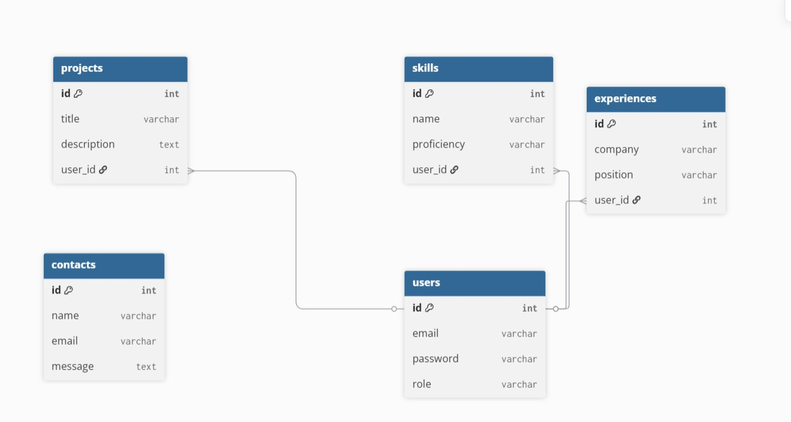

## Handan Portfolio — Milestone 1

This repository contains the frontend for my portfolio project for Milestone 1. It is a responsive single-page application built with Bootstrap and vanilla JavaScript. Pages live in `frontend/views/` and are loaded dynamically by `frontend/js/spapp.js`. To run locally, place the project folder in c:/xampp/htdocs/portfolio-handan, start Apache in XAMPP, and open http://localhost/portfolio-handan/frontend/index.html. Key files and folders are `frontend/index.html`, `frontend/views/`, `frontend/css/`, `frontend/js/` and `frontend/assets/images/`. The ERD diagram is at frontend/assets/images/erd-diagram.jpg.


# Handan Portfolio — Milestone 2

## What's New in Milestone 2:
- **MySQL database** with 5 tables: users, projects, skills, experiences, contacts
- **DAO classes** for CRUD operations (Create, Read, Update, Delete)

## How to Run:
1. Place project in `c:/xampp/htdocs/portfolio-handan`
2. Start Apache and MySQL in XAMPP
3. Import database: open `backend/config/database.sql` in phpMyAdmin
4. Open: `http://localhost/portfolio-handan/frontend/index.html`

## Important Files:
- `frontend/` - HTML, CSS, JS files
- `backend/config/database.sql` - database setup
- `backend/dao/` - DAO classes for database access
- `backend/test_dao.php` - test if backend works

**Contact:** alihandan@stu.ibu.edu.ba

# Handan Portfolio — Milestone 3

## What's New in Milestone 3:
- **Business Logic Layer**: Service classes for all entities (UserService, SkillService, ExperienceService, ProjectService, ContactService)
- **JWT Authentication**: Secure token-based authentication using Firebase/PHP-JWT
- **REST API Routes**: Complete CRUD operations with proper HTTP methods (GET, POST, PUT, DELETE)
- **OpenAPI/Swagger Documentation**: Interactive API documentation with Swagger UI
- **Route Definitions**: All endpoints documented with Swagger annotations

## Key Features:
- Secure JWT-based authentication for protected routes
- RESTful API endpoints following best practices
- Interactive API documentation at `/backend/public/v1/docs/`
- Dependency injection container using FlightPHP
- Prepared statements for SQL security
- Service layer for business logic separation

## Technologies Used:
- **FlightPHP** 3.17+ - Lightweight REST API framework
- **Firebase/PHP-JWT** 6.0 - JWT authentication
- **Zircote Swagger-PHP** 5.5 - OpenAPI documentation
- **MySQL** 5.7+ with PDO - Database layer

## How to Run:
1. Place project in `c:/xampp/htdocs/mojnoviprojekat`
2. Start Apache and MySQL in XAMPP
3. Import database: run `backend/config/database.sql` in phpMyAdmin
4. Access Swagger UI: `http://localhost/mojnoviprojekat/web-programming/backend/public/v1/docs/`

## API Testing:
1. Register: POST `/auth/register`
2. Login: POST `/auth/login` (returns JWT token)
3. Use token in Authorization header: `Authorization: Bearer <token>`
4. Access protected endpoints with the token

## Important Files:
- `backend/services/` - Business logic layer
- `backend/routes/` - API endpoint definitions
- `backend/middleware/AuthMiddleware.php` - JWT authentication
- `backend/public/v1/docs/` - Swagger documentation
- `backend/dao/` - Data access objects (from Milestone 2)
- `backend/config/database.sql` - Database schema

## Deployment Note:
For production, change the secret key in `backend/middleware/AuthMiddleware.php` from the default value.

**Contact:** alihandan@stu.ibu.edu.ba

```
